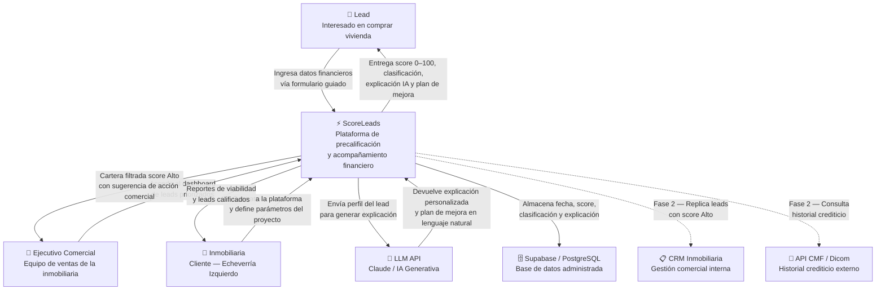

# Diagrama de Contexto — ScoreLeads

> Muestra cómo cada actor externo se relaciona con la plataforma ScoreLeads. Las líneas sólidas corresponden al MVP actual; las líneas punteadas corresponden a integraciones planificadas para Fase 2 (post-MVP).

---

---

## Descripción de actores y relaciones

### Actores del MVP

| Actor | Tipo | Relación con ScoreLeads |
| :---- | :--- | :---------------------- |
| **Lead** | Usuario final | Ingresa sus datos financieros básicos mediante un formulario guiado. Recibe su score (0–100), clasificación (Alto / Medio / Bajo), explicación de factores y plan de mejora personalizado. |
| **Ejecutivo Comercial** | Usuario operador | Accede al dashboard de leads precalificados. Visualiza la cartera filtrada por score Alto, indicadores financieros de cada lead y sugerencias de acción comercial ("contactar pronto" / "mantener en seguimiento"). |
| **Inmobiliaria** | Cliente / Contratante | Organización que contrata la plataforma. Define los parámetros del proyecto (comuna objetivo, precio referencial). Recibe reportes de viabilidad y mejora la eficiencia de su embudo comercial. |
| **LLM API** | Sistema externo (IA) | API de IA generativa (ej. Claude) consumida por el backend para producir explicaciones personalizadas del score y planes de mejora en lenguaje natural. No es un componente propio de la plataforma. |
| **Supabase / PostgreSQL** | Sistema externo (datos) | Base de datos administrada donde se persiste cada evaluación: fecha, score obtenido, clasificación asignada y explicación generada. |

### Integraciones Fase 2 (post-MVP)

| Sistema | Propósito |
| :------ | :-------- |
| **CRM Inmobiliaria** | Replicar automáticamente los leads con score Alto al flujo comercial interno de la inmobiliaria, eliminando la gestión manual. |
| **API CMF / Dicom** | Incorporar historial crediticio externo para mejorar la precisión del motor de scoring, validando los datos autodeclarados por el usuario. |
